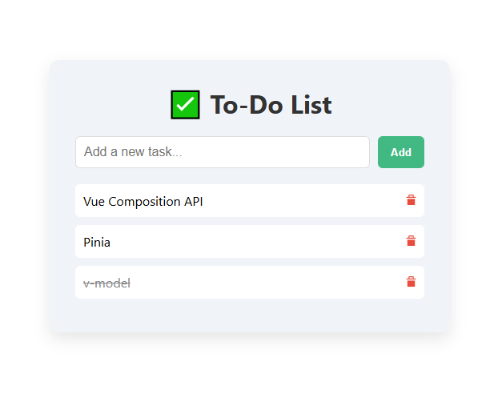

# ✅ Vue 3 To-Do List App

A clean and interactive To-Do List app built with **Vue 3 Composition API**, featuring reusable components, scoped CSS, and a custom inline SVG delete icon.



---

## 🚀 Features

- Add new tasks
- Toggle tasks as completed
- Delete tasks with a custom icon
- Fully reusable `DeleteIcon.vue` component

---

## 🛠 Tech Stack

- [Vue 3](https://vuejs.org/)
- Composition API (`<script setup>`)

## 🧪 Demo
clone and run it locally 👇

## 💻 Getting Started

### 1. Clone the repo

```bash
git clone https://github.com/NurmuhammadMirov/vue-to-do.git
cd vue-to-do
```
### 2. Install dependencies

```bash
npm install
```
### 3. Start development server

```bash
npm run dev
```
Visit http://localhost:5173 in your browser 🚀

## 🤓 What I Learned

- How to build a Vue 3 app using the **Composition API**
- Using `ref()` to manage reactive state
- Handling forms with `v-model` and `@submit.prevent`
- Displaying lists with `v-for`
- Toggling task completion using dynamic class binding
- Removing tasks from an array
- Creating a **reusable component** (`DeleteIcon.vue`)
- Using **inline SVG** for full CSS styling control

---

Made with ❤️ while learning Vue 3